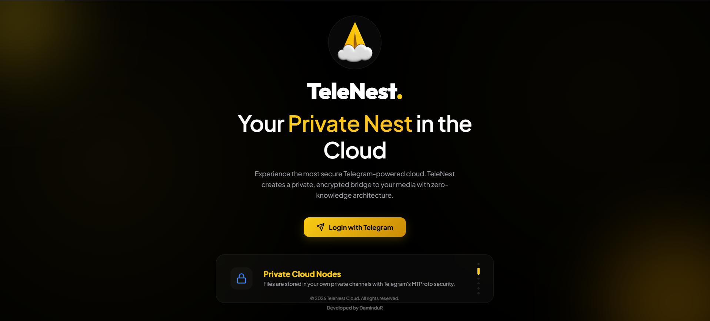
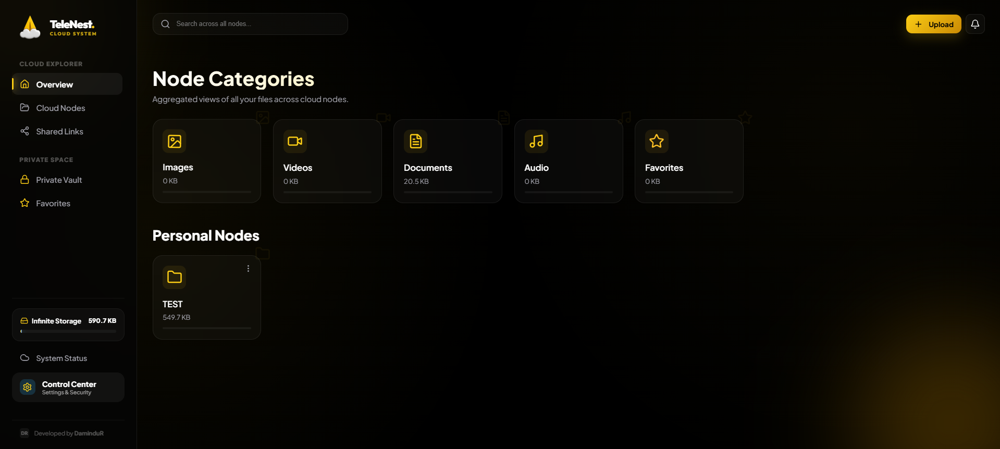
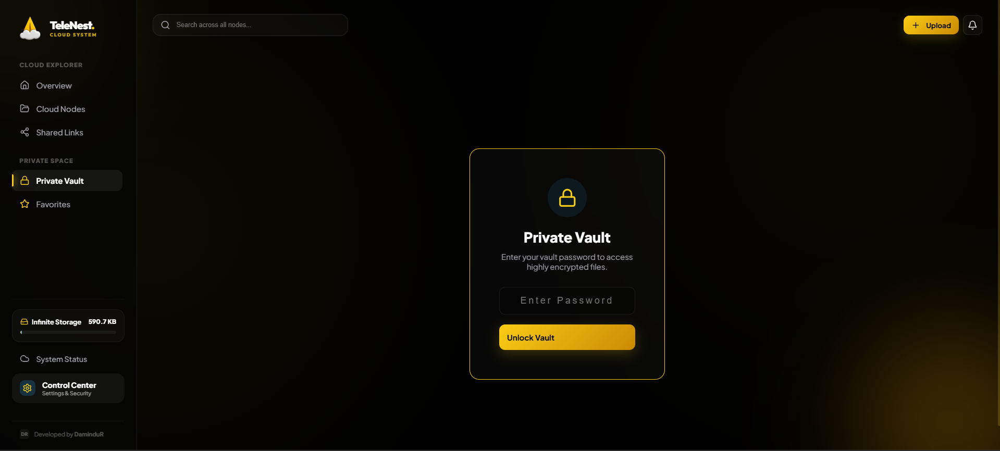
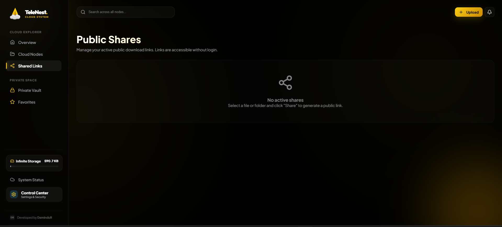

<div align="center">


# TeleNest. Cloud System

### *Your Private Nest in the Cloud — Powered by Telegram*

[](https://react.dev)
[](https://nodejs.org)
[](https://vitejs.dev)
[](https://core.telegram.org)
[](LICENSE)
[](https://damindur.com)

<br/>

> **TeleNest transforms your Telegram account into a powerful, private, and infinite cloud storage system — with a premium dashboard you'll actually love using.**

<br/>

[🚀 Get Started](#-getting-started) · [✨ Features](#-features) · [🛠️ Tech Stack](#%EF%B8%8F-tech-stack) · [📸 Screenshots](#-screenshots) · [🤝 Contributing](#-contributing)

</div>

---

## ✨ Features

<table>
<tr>
<td width="50%">

### 🗂️ Smart Node Organization
Organize your files into **Cloud Nodes** (private Telegram channels). Create, rename, and manage as many nodes as you need.

</td>
<td width="50%">

### 🔒 Private Vault
A password-protected, auto-locking vault for your most sensitive files. Zero trace, zero compromise.

</td>
</tr>
<tr>
<td width="50%">

### 🎬 Instant Streaming
Stream **videos and audio** directly from your Telegram cloud nodes — no download required.

</td>
<td width="50%">

### ⭐ Favorites & Trash
Star your most-used files for lightning-fast access. A smart Trash Vault auto-cleans after 3 days.

</td>
</tr>
<tr>
<td width="50%">

### 🔗 Public Link Sharing
Generate secure, shareable links for **any file or folder** in your cloud — one click, anyone can access.

</td>
<td width="50%">

### 🔍 Blazing-Fast Search
Full-text search across **all your cloud nodes** simultaneously, with real-time results.

</td>
</tr>
<tr>
<td width="50%">

### 📱 Fully Mobile Responsive
A premium experience from the 4K monitor to the phone in your pocket. Sidebar drawer, adaptive grids — all included.

</td>
<td width="50%">

### 🔔 Real-time Notifications
System-wide notification center for all operations — uploads, moves, deletions — keep track of everything.

</td>
</tr>
</table>

## 📸 Screenshots

<div align="center">

| **Landing Page** | **Node Categories** |
|:---:|:---:|
|  |  |
| **Main Dashboard** | **Private Vault** |
|  |  |

</div>

---

## 🛠️ Tech Stack

| Layer | Technology |
|---|---|
| **Frontend Framework** | React 19 + TypeScript |
| **Build Tool** | Vite 8 |
| **Animations** | Framer Motion |
| **Icons** | Lucide React |
| **HTTP Client** | Axios |
| **Routing** | React Router DOM v7 |
| **Backend Runtime** | Node.js + Express |
| **Telegram API** | GramJS (MTProto) |
| **Styling** | Vanilla CSS + CSS Variables (Glassmorphism) |
| **Desktop App** | Electron |

---

### 🚀 Getting Started

#### ⚡ Quick Install (Windows)

**Option 1: Command Prompt (CMD)** - Recommended
```cmd
git clone https://github.com/DaminduRat/TeleNest.-Cloud-System.git && cd TeleNest.-Cloud-System && setup.bat
```

**Option 2: PowerShell**
```powershell
git clone https://github.com/DaminduRat/TeleNest.-Cloud-System.git; cd TeleNest.-Cloud-System; .\setup.bat
```

#### 🛠️ Manual Installation

**1. Clone the Repository**
```bash
git clone https://github.com/DaminduRat/TeleNest.-Cloud-System.git
cd TeleNest.-Cloud-System
```

**2. Install All Dependencies**

*Windows:*
```bash
# Just double-click setup.bat, OR run manually:
npm install
cd server
npm install
cd ..
```

*Mac / Linux:*
```bash
npm install && cd server && npm install && cd ..
```

**3. Start the Application**

*Windows:*
```bash
# Just double-click run.bat
```

*Mac / Linux:*
```bash
npm start
```

### ⚡ One-Click Workflow (Windows Only)

To make your life easier, use these built-in tools:

- **`setup.bat`**: Installs everything (Run this first).
- **`run.bat`**: Starts the app (Frontend + Backend).
- **`sync.bat`**: Adds, commits, and pushes your changes to GitHub in one click.

---

| Service | URL |
|---|---|
| 🌐 Frontend | `http://localhost:5173` |
| ⚙️ Backend API | `http://localhost:3001` |

**4. First-Time Setup**

On your first visit, TeleNest will guide you through:
1. Enter your **Telegram Phone Number**
2. Enter the **Login Code** sent to your Telegram
3. TeleNest automatically creates private channels as your storage nodes
4. Done! Your personal cloud is ready. ☁️

---

## 🏗️ Project Architecture

```
telenest-cloud/
├── 📁 public/              # Static assets (logo, icons)
├── 📁 server/
│   ├── index.js            # Express API server (all REST endpoints)
│   └── telegram.js         # GramJS Telegram client (file I/O engine)
├── 📁 src/
│   ├── 📁 components/
│   │   ├── FolderCard.tsx  # Node/folder card UI component
│   │   ├── Sidebar.tsx     # Responsive navigation sidebar
│   │   ├── SettingsView.tsx # Advanced settings panel
│   │   └── TelegramManager.tsx # Account & status manager
│   ├── 📁 pages/
│   │   ├── Dashboard.tsx   # Main app shell (all sections)
│   │   ├── Landing.tsx     # Auth / login page
│   │   └── Initialization.tsx # First-time setup wizard
│   ├── index.css           # Global design system & CSS variables
│   └── main.tsx            # App entry point
├── .gitignore
├── setup.bat               # Windows one-click setup
├── package.json
└── README.md
```

---

## 🛡️ Privacy & Security

TeleNest is built with a **Zero-Knowledge Architecture** philosophy:

- 🔐 **Local Sessions Only** — Your Telegram session is stored exclusively on **your own machine**. No server ever sees it.
- 📡 **Direct Encryption** — Files travel directly between your device and Telegram's MTProto-encrypted servers.
- 🚫 **No Third Parties** — TeleNest has no central database, no analytics, no tracking. Your data is yours.
- 🗝️ **Dynamic Credentials** — API keys are entered through the UI at runtime, never hardcoded in source.

---

## 🤖 Built With AI — Vibe Coded

This project was designed and built using the **Vibe Coding** methodology — leveraging cutting-edge AI models to accelerate every aspect of development, from architecture to pixel-perfect UI.

<div align="center">

| AI Tool | Role |
|---|---|
| 🔵 **Google Gemini** | Architecture planning, logic design & research |
| 🟣 **Claude (Anthropic)** | Code refinement, debugging & component design |
| ⚡ **Antigravity (by Google DeepMind)** | Full-stack implementation, feature building & GitHub push |

*"The future of development is humans with taste, guided by AI with capability."*

</div>

---

## 👨‍💻 Developer

<div align="center">

<br/>

**DaminduR**

*Full-Stack Developer · Vibe Coder · Creator of TeleNest*

[](https://damindur.com)
[](https://github.com/DaminduRat)

<br/>

</div>

---

<div align="center">

**⭐ If you found this project useful, please give it a star! ⭐**

*TeleNest Cloud — © 2026 DaminduR. All rights reserved.*

</div>
